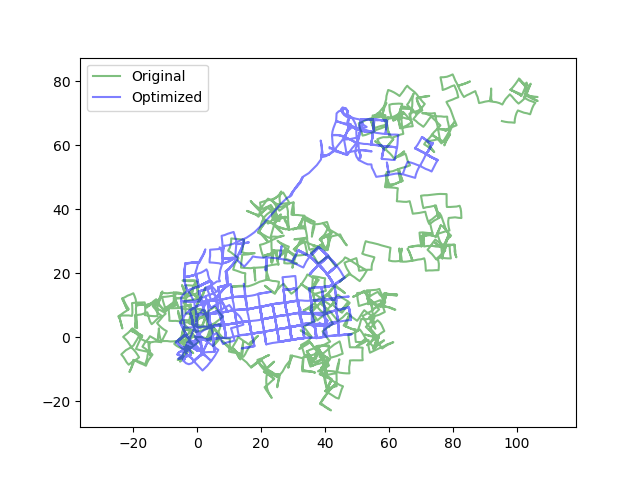
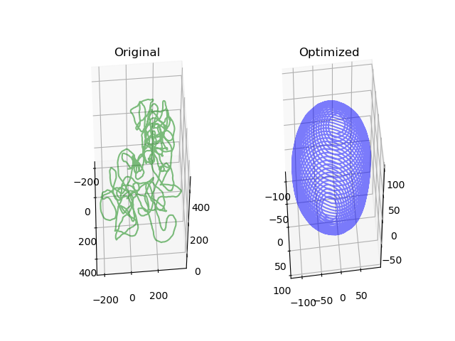

# ceres-solver
***
You know that there are some examples in ceres-solver project downloaded from ceres-solver official github which you can use to learn ceres. But I failed to build the example, so I started to rewrite examples in a saperated project.

In the document dataset you will see several .g2o file, some of them is 2d data, and some of them is 3d data, you can also download these datatset from the website
https://lucacarlone.mit.edu/datasets/ 
 and you need also refer to https://github.com/ceres-solver/ceres-solver/tree/master/examples/slam/pose_graph_2d   and https://github.com/ceres-solver/ceres-solver/tree/master/examples/slam/pose_graph_3d to plot your results.

  
Fig 1. 2d optimization result

  
Fig 2. 3d optimization result

